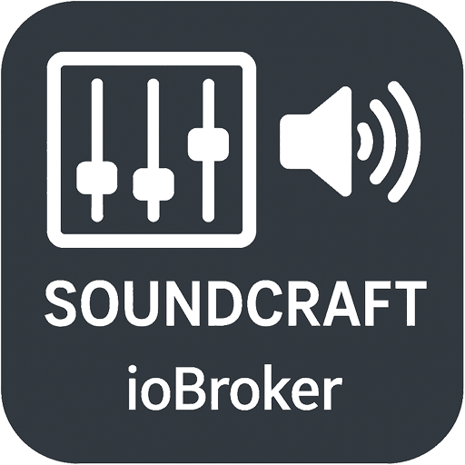

# ioBroker.soundcraft

[](https://www.npmjs.com/package/iobroker.soundcraft)
[](https://www.npmjs.com/package/iobroker.soundcraft)


[](https://nodei.co/npm/iobroker.soundcraft/)

**Tests:** 

## soundcraft adapter for ioBroker

Control and monitor your Soundcraft Ui series digital mixer from ioBroker.

This adapter provides full integration with Soundcraft Ui12, Ui16, and Ui24R digital mixers, allowing you to control all mixer functions through ioBroker and integrate them with your smart home automation.

## Features

### Supported Mixers
- Soundcraft Ui12
- Soundcraft Ui16  
- Soundcraft Ui24R

The adapter automatically detects your mixer model and creates the appropriate channels.

### Master Control
- **Fader Level**: Master output volume control (0-1)
- **Pan**: Master stereo pan control (0-1)
- **Dim**: Master dim function for monitoring (0-1)

### Hardware Input Channels
Full control for all hardware input channels (12/16/24 depending on model):
- **Fader Level**: Channel volume/fader position (0-1)
- **Mute**: Mute state (0=unmuted, 1=muted)
- **Pan**: Stereo pan position (0-1)
- **Gain**: Input gain/trim (0-1)
- **Phantom Power**: +48V phantom power for condenser microphones (0=off, 1=on)

### AUX Buses (10 buses)
Each AUX bus has:
- **Master Controls**: Fader Level, Mute, Pan for the AUX output
- **Input Routing**: Individual control for each hardware input to the AUX bus
  - Fader Level per input
  - Mute per input
  - Pan per input
  
Example: `aux.3.input.2.faderLevel` controls how much of Input 2 is sent to AUX 3

### FX Buses (4 buses)
- **Fader Level**: FX send level (0-1)
- **Mute**: FX mute state (0-1)

### Mute Groups (6 groups)
- Control mute groups 1-6 (0=unmuted, 1=muted)
- Mute/unmute multiple channels simultaneously

### Media Player Control
- **State**: Current player state (idle/playing/paused/stopped)
- **Play**: Start playback
- **Stop**: Stop playback
- **Pause**: Pause playback

## How It Works

### Connection
The adapter connects to your Soundcraft Ui mixer via WebSocket over your local network. The mixer must be on the same network as your ioBroker server.

### Real-time Synchronization
- All mixer changes (via hardware, web interface, or app) are automatically synchronized to ioBroker
- Changes made in ioBroker are immediately sent to the mixer
- Uses RxJS observables for efficient real-time updates

### Configuration
1. Install the adapter from the ioBroker repository or npm
2. Configure the adapter instance:
   - **Mixer IP Address**: The IP address of your Soundcraft Ui mixer (e.g., 192.168.1.100)
   - **Poll Interval**: How often to check connection status (default: 1000ms)
   - **Enable VU Meter**: Optional VU meter monitoring (increases CPU usage)
   - **VU Meter Interval**: Update frequency for VU meters (default: 100ms)

### Object Structure

```
soundcraft.0/
├── info/
│   ├── connection (boolean)
│   └── model (string)
├── master/
│   ├── faderLevel
│   ├── pan
│   └── dim
├── hw/
│   ├── 0/
│   │   ├── faderLevel
│   │   ├── mute
│   │   ├── pan
│   │   ├── gain
│   │   └── phantom
│   ├── 1/ ...
│   └── 23/ (depending on model)
├── aux/
│   ├── 0/
│   │   ├── faderLevel
│   │   ├── mute
│   │   ├── pan
│   │   └── input/
│   │       ├── 0/ (faderLevel, mute, pan)
│   │       ├── 1/ ...
│   │       └── 23/ (all hardware inputs)
│   ├── 1/ ...
│   └── 9/
├── fx/
│   ├── 0/ (faderLevel, mute)
│   ├── 1/ ...
│   └── 3/
├── muteGroup/
│   ├── 1
│   ├── 2
│   └── 6
└── player/
    ├── state
    ├── play
    ├── stop
    └── pause
```

## Use Cases

### Home Automation Examples
- Automatically mute all inputs when leaving home
- Set specific mixer scenes based on time of day
- Control background music volume based on room occupancy
- Integrate mixer control with voice assistants via ioBroker
- Monitor connection status and send alerts if mixer goes offline
- Create custom control panels in ioBroker VIS

### Professional Applications
- Remote mixer control for installed sound systems
- Automated venue setups
- Integration with lighting and other show control systems
- Preset recall through ioBroker scripts
- Monitoring and logging of mixer settings

## Requirements

- ioBroker server (Node.js >= 20)
- Soundcraft Ui12, Ui16, or Ui24R mixer
- Network connection between ioBroker and mixer
- Admin adapter >= 5.0.0

## Technical Details

Based on the [soundcraft-ui-connection](https://www.npmjs.com/package/soundcraft-ui-connection) library (v4.0.0), which provides WebSocket communication with Soundcraft Ui mixers.

## Changelog
<!--
	Placeholder for the next version (at the beginning of the line):
	### **WORK IN PROGRESS**
-->

### 0.0.1
* (Dennion) initial release

## License
MIT License

Copyright (c) 2025 Dennion

Permission is hereby granted, free of charge, to any person obtaining a copy
of this software and associated documentation files (the "Software"), to deal
in the Software without restriction, including without limitation the rights
to use, copy, modify, merge, publish, distribute, sublicense, and/or sell
copies of the Software, and to permit persons to whom the Software is
furnished to do so, subject to the following conditions:

The above copyright notice and this permission notice shall be included in all
copies or substantial portions of the Software.

THE SOFTWARE IS PROVIDED "AS IS", WITHOUT WARRANTY OF ANY KIND, EXPRESS OR
IMPLIED, INCLUDING BUT NOT LIMITED TO THE WARRANTIES OF MERCHANTABILITY,
FITNESS FOR A PARTICULAR PURPOSE AND NONINFRINGEMENT. IN NO EVENT SHALL THE
AUTHORS OR COPYRIGHT HOLDERS BE LIABLE FOR ANY CLAIM, DAMAGES OR OTHER
LIABILITY, WHETHER IN AN ACTION OF CONTRACT, TORT OR OTHERWISE, ARISING FROM,
OUT OF OR IN CONNECTION WITH THE SOFTWARE OR THE USE OR OTHER DEALINGS IN THE
SOFTWARE.